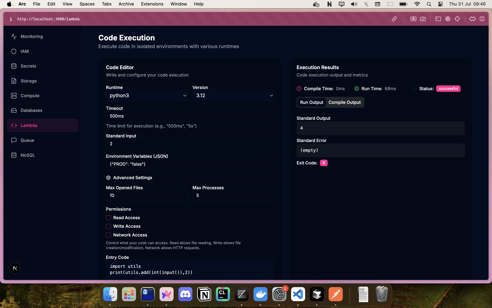
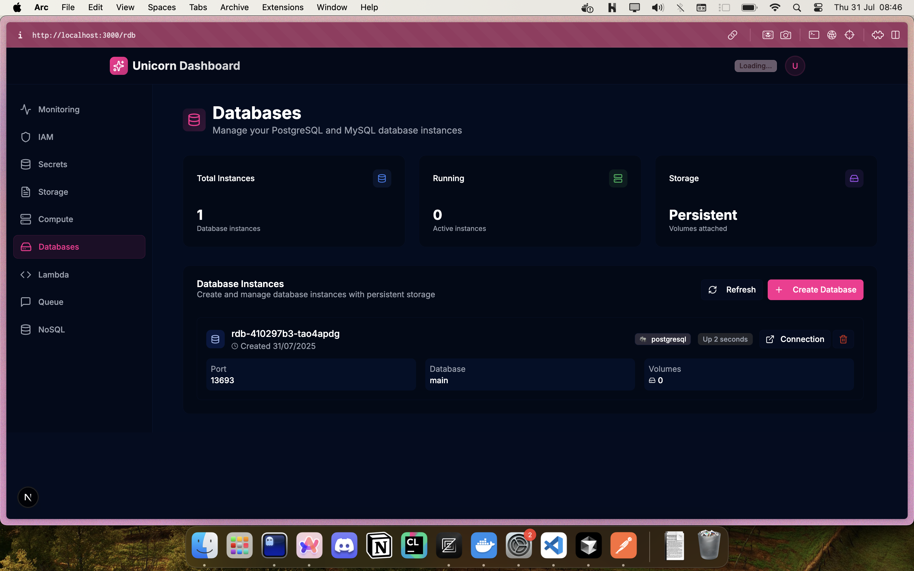
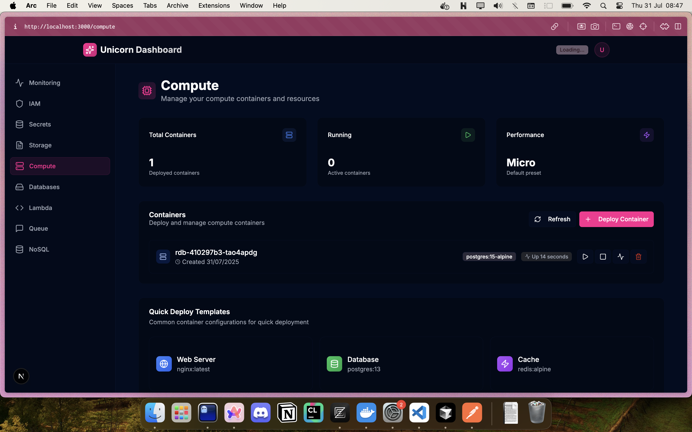

# 🦄 Unicorn Web Services Platform

_Warning: augmented by AI_



A comprehensive cloud services platform providing Infrastructure as a Service (IaaS) capabilities with a modern web dashboard and robust API backend.





## 🏗️ Architecture Overview

This platform consists of three main components:

### 🚀 **Unicorn API** (Backend)

- **Language**: Go 1.23+ with Gin framework
- **Database**: SQLite with GORM ORM
- **Authentication**: JWT-based with role-based access control
- **Documentation**: Swagger/OpenAPI 3.0
- **Testing**: Comprehensive test suite with integration tests

### 🎨 **Unicorn Dashboard** (Frontend)

- **Framework**: Next.js 15.4+ with React 19
- **Styling**: Tailwind CSS with Radix UI components
- **State Management**: React Context API
- **Forms**: React Hook Form with Zod validation
- **UI**: Modern, responsive design with dark/light themes

### ⚡ **Lambda API** (Serverless Functions)

- **Language**: Go with Chi router
- **Message Broker**: Redis for task queuing
- **Architecture**: Event-driven with worker pattern
- **Containerization**: Docker with Nix build environment

## 🔧 Core Services

### 🔐 **Identity & Access Management (IAM)**

- User authentication and authorization
- Role-based access control (RBAC)
- Organization and user management
- JWT token management with refresh capabilities
- Permission system (Read, Write, Delete)

### 💾 **Storage Service**

- File upload/download management
- Bucket-based organization
- File metadata tracking
- Secure file access controls

### 🔒 **Secrets Manager**

- Secure secret storage and retrieval
- Key rotation capabilities
- Version control for secrets
- Encryption at rest

### 🖥️ **Compute Service**

- Virtual machine management
- Resource provisioning
- Compute instance lifecycle management

### ⚡ **Lambda Functions**

- Serverless function execution
- Event-driven processing
- Task queuing with Redis
- Worker-based architecture

### 🗄️ **Relational Database (RDB)**

- Database instance management
- Multi-tenant database provisioning
- Database lifecycle operations

### 📊 **Monitoring & Analytics**

- Resource usage tracking
- Billing and cost management
- Performance metrics collection
- Usage trends and analytics
- Real-time monitoring dashboards

## 🛠️ Technical Stack

### Backend Technologies

- **Go 1.23+**: High-performance server-side language
- **Gin**: Fast HTTP web framework
- **GORM**: Object-relational mapping
- **SQLite**: Lightweight database
- **JWT**: JSON Web Token authentication
- **Swagger**: API documentation
- **Docker**: Containerization
- **Redis**: Caching and message queuing

### Frontend Technologies

- **Next.js 15.4+**: React framework with SSR
- **React 19**: Modern UI library
- **TypeScript**: Type-safe development
- **Tailwind CSS**: Utility-first CSS framework
- **Radix UI**: Accessible component primitives
- **React Hook Form**: Form state management
- **Zod**: Schema validation
- **Axios**: HTTP client

### DevOps & Tools

- **Docker**: Container orchestration
- **Make**: Build automation
- **Nix**: Reproducible builds
- **ESLint**: Code linting
- **Prettier**: Code formatting

## 🚀 Getting Started

### Prerequisites

- Go 1.23+
- Node.js 18+
- Docker
- Redis (for Lambda API)

### Backend Setup

```bash
cd unicorn-api
go mod download
make build
make run
```

### Frontend Setup

```bash
cd unicorn-dashboard
npm install
npm run dev
```

### Lambda API Setup

```bash
cd lambda-api
docker-compose up -d
```

## 📚 API Documentation

The API is fully documented with Swagger/OpenAPI 3.0:

- **Swagger UI**: Available at `/swagger/index.html`
- **OpenAPI Spec**: Available at `/swagger/doc.json`
- **API Versioning**: All endpoints use `/api/v1/` prefix

### Key API Endpoints

#### Authentication

- `POST /api/v1/login` - User authentication
- `POST /api/v1/token/refresh` - Token refresh
- `GET /api/v1/token/validate` - Token validation

#### IAM Management

- `POST /api/v1/organizations` - Create organization
- `POST /api/v1/roles` - Create role
- `POST /api/v1/organizations/:org_id/users` - Create user

#### Resource Management

- `GET /api/v1/secrets` - List secrets
- `POST /api/v1/compute/create` - Create compute instance
- `POST /api/v1/rdb/create` - Create database
- `GET /api/v1/buckets` - List storage buckets

#### Monitoring

- `GET /api/v1/monitoring/usage` - Resource usage
- `GET /api/v1/monitoring/billing` - Billing history
- `GET /api/v1/monitoring/trends` - Usage trends

## 🧪 Testing

### Backend Testing

```bash
# Run all tests
make test-all
```

### Frontend Testing

```bash
# Run linting
npm run lint

# Run type checking
npx tsc --noEmit
```

## 🔒 Security Features

- **JWT Authentication**: Secure token-based authentication
- **Role-Based Access Control**: Granular permission system
- **Input Validation**: Comprehensive request validation
- **CORS Protection**: Cross-origin resource sharing controls
- **Error Handling**: Secure error responses
- **Rate Limiting**: API rate limiting capabilities

## 📊 Monitoring & Observability

- **Resource Usage Tracking**: Real-time resource monitoring
- **Billing Integration**: Cost tracking and billing generation
- **Performance Metrics**: Response time and throughput monitoring
- **Error Tracking**: Comprehensive error logging and reporting
- **Usage Analytics**: Trend analysis and reporting

## 🚀 Deployment

### Docker Deployment

```bash
# Build and run with Docker Compose
docker-compose up -d
```

### Production Build

```bash
# Backend
make build-linux

# Frontend
npm run build
```

## 🤝 Contributing

1. Fork the repository
2. Create a feature branch
3. Make your changes
4. Add tests for new functionality
5. Ensure all tests pass
6. Submit a pull request

## 📄 License

This project is licensed under the MIT License - see the LICENSE file for details.

## 🆘 Support

For support and questions:

- Create an issue in the repository
- Check the API documentation
- Review the test examples

---

**Built with ❤️ using modern cloud-native technologies**
